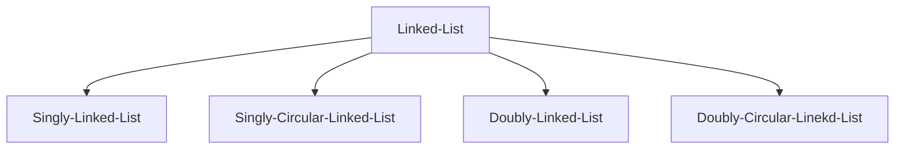

# 연결 리스트(Linked List)


## 단일 연결 리스트(Singly Linked List)
### Declaration
```c
typedef struct SinglyLinkedNode {
    int data;
    struct SinglyLinkedNode* next;
} SinglyLinkedNode;

typedef struct {
    SinglyLinkedNode* head;
    SinglyLinkedNode* tail;
    int size;
} SinglyLinkedList;
```
### Method
|NO|METHOD                                                              |DESCRIPTION
|-:|:-------------------------------------------------------------------|:--
| 1|SinglyLinkedNode* create_node(int data)                             |새로운 노드를 생성합니다.
| 2|SinglyLinkedNode* get_at_index(SinglyLinkedList* list, int index)   |특정 위치의 노드의 주소를 반환합니다.
| 3|SinglyLinkedNode* get_by_value(SinglyLinkedList* list, int data)    |특정 데이터를 가진 노드의 주소를 반환합니다.
| 4|void prepend(SinglyLinkedList* list, int data)                      |단일 연결 리스트의 맨 앞에 새로운 노드를 추가합니다.
| 5|void append(SinglyLinkedList* list, int data)                       |단일 연결 리스트의 맨 뒤에 새로운 노드를 추가합니다.
| 6|void insert(SinglyLinkedList* list, int data, int index)            |특정 위치에 새로운 노드를 추가합니다.
| 7|void remove_front(SinglyLinkedList* list)                           |단일 연결 리스트의 맨 앞에 있는 노드를 제거합니다.
| 8|void remove_back(SinglyLinkedList* list)                            |단일 연결 리스트의 맨 뒤에 있는 노드를 제거합니다.
| 9|void remove_at_index(SinglyLinkedList* list, int index)             |특정 위치의 노드를 제거합니다.
|10|void remove_by_value(SinglyLinkedList* list, int data)              |특정 데이터를 가진 노드를 제거합니다.
|11|bool is_empty(SinglyLinkedList* list)                               |단일 연결 리스트가 비어있는지 여부를 반환합니다.
|12|void clear(SinglyLinkedList* list)                                  |단일 연결 리스트를 비웁니다.
|13|void print(SinglyLinkedList* list)                                  |단일 연결 리스트의 데이터들을 출력합니다.
### Prototype
```c
/**
 *  @brief 새로운 노드를 생성합니다.
 *
 *  @param data
 *  생성할 노드의 데이터 값
 *
 *  @return SinglyLinkedNode*
 *  data 값을 가진 단일 연결 노드의 주소
 *
 *  @exception 메모리 할당 실패 시
 *  "Error: Memory allocation is faild." 출력 후 NULL 반환
 */
SinglyLinkedNode* create_node(int data);

/**
 *  @brief 특정 위치의 노드의 주소를 반환합니다.
 *
 *  @param list
 *  단일 연결 리스트 주소
 *  @param index
 *  찾으려는 노드의 위치 값(0부터 list->size - 1까지)
 *
 *  @return SinglyLinkedNode*
 *  특정 위치의 노드의 주소
 *
 *  @exception list가 NULL인 경우
 *  "Error: List is NULL." 출력 후 NULL 반환
 *  @exception index가 0보다 작거나 list->size - 1 보다 큰 경우
 *  "Error: Index out of bounds." 출력 후 NULL 반환
 */
SinglyLinkedNode* get_at_index(SinglyLinkedList* list, int index);

/**
 *  @brief 특정 데이터를 가진 노드의 주소를 반환합니다.
 *
 *  @param list
 *  단일 연결 리스트 주소
 *  @param data
 *  찾으려는 노드의 data 값
 *
 *  @return SinglyLinkedNode*
 *  특정 data를 가진 노드의 주소.
 *  특정 data를 가진 노드가 없으면 NULL.
 *  특정 data를 가진 노드가 여러개인 경우 그 중 첫번째 노드의 주소 반환.
 *
 *  @exception list가 NULL인 경우
 *  "Error: List is NULL." 출력 후 NULL 반환
 */
SinglyLinkedNode* get_by_value(SinglyLinkedList* list, int data);

/**
 *  @brief 단일 연결 리스트의 맨 앞에 새로운 노드를 추가합니다.
 *
 *  @param list
 *  단일 연결 리스트 주소
 *  @param data
 *  추가할 노드의 data 값
 *
 *  @return void
 *
 *  @exception list가 NULL인 경우
 *  "Error: List is NULL." 출력 후 함수 종료
 *  @exception 새로운 노드 생성에 실패한 경우
 *  함수 종료
 */
void prepend(SinglyLinkedList* list, int data);

/**
 *  @brief 단일 연결 리스트의 맨 뒤에 새로운 노드를 추가합니다.
 *
 *  @param list
 *  단일 연결 리스트 주소
 *  @param data
 *  추가할 노드의 data 값
 *
 *  @return void
 *
 *  @exception list가 NULL인 경우
 *  "Error: List is NULL." 출력 후 함수 종료
 *  @exception 새로운 노드 생성에 실패한 경우
 *  함수 종료
 */
void append(SinglyLinkedList* list, int data);

/**
 *  @brief 특정 위치에 새로운 노드를 추가합니다.
 *  
 *  @param list
 *  단일 연결 리스트 주소
 *  @param data
 *  추가할 노드의 data 값
 *  @param index
 *  추가하려는 위치 값(0부터 list->size까지)
 *  
 *  @return void
 *  
 *  @exception list가 NULL인 경우
 *  "Error: List is NULL." 출력 후 함수 종료
 *  @exception index가 0보다 작거나 list->size 보다 큰 경우
 *  "Error: Index out of bounds." 출력 후 함수 종료
 *  @exception 새로운 노드 생성에 실패한 경우
 *  함수 종료
 */
void insert(SinglyLinkedList* list, int data, int index);

/**
 *  @brief 단일 연결 리스트의 맨 앞에 있는 노드를 제거합니다.
 *  
 *  @param list
 *  단일 연결 리스트 주소
 *  
 *  @return void
 *  
 *  @exception list가 NULL인 경우
 *  "Error: List is NULL." 출력 후 함수 종료
 *  @exception list의 size가 0인 경우
 *  "Error: List is empty." 출력 후 함수 종료
 */
void remove_front(SinglyLinkedList* list);

/**
 *  @brief 단일 연결 리스트의 맨 뒤에 있는 노드를 제거합니다.
 *  
 *  @param list
 *  단일 연결 리스트 주소
 *  
 *  @return void
 *  
 *  @exception list가 NULL인 경우
 *  "Error: List is NULL." 출력 후 함수 종료
 *  @exception list의 size가 0인 경우
 *  "Error: List is empty." 출력 후 함수 종료
 */
void remove_back(SinglyLinkedList* list);

/**
 *  @brief 특정 위치의 노드를 제거합니다.
 *  
 *  @param list
 *  단일 연결 리스트 주소
 *  @param index
 *  삭제하려는 위치 값(0부터 list->size - 1까지)
 *  
 *  @return void
 *  
 *  @exception list가 NULL인 경우
 *  "Error: List is NULL." 출력 후 함수 종료
 *  @exception list의 size가 0인 경우
 *  "Error: List is empty." 출력 후 함수 종료
 *  @exception index가 0보다 작거나 list->size - 1 보다 큰 경우
 *  "Error: Index out of bounds." 출력 후 함수 종료
 */
void remove_at_index(SinglyLinkedList* list, int index);

/**
 *  @brief 특정 데이터를 가진 노드를 제거합니다.
 *  특정 데이터를 가진 노드가 여러개인 경우 그 중 첫번째 노드를 제거합니다.
 *  
 *  @param list
 *  단일 연결 리스트 주소
 *  @param data
 *  제거할 노드의 data 값
 *  
 *  @return void
 *  
 *  @exception list가 NULL인 경우
 *  "Error: List is NULL." 출력 후 함수 종료
 *  @exception list의 size가 0인 경우
 *  "Error: List is empty." 출력 후 함수 종료
 *  @exception data 값을 가진 노드가 없는 경우
 *  "Error: Data does not exist." 출력 후 함수 종료
 */
void remove_by_value(SinglyLinkedList* list, int data);

/**
 *  @brief 단일 연결 리스트가 비어있는지 여부를 반환합니다.
 *  
 *  @param list
 *  단일 연결 리스트 주소
 *  
 *  @return bool
 *  list가 비어있으면 true, 비어있지 않으면 false 반환
 *  
 *  @exception list가 NULL인 경우
 *  "Error: List is NULL." 출력 후 false 반환
 */
bool is_empty(SinglyLinkedList* list);

/**
 *  @brief 단일 연결 리스트를 비웁니다.
 *  
 *  @param list
 *  단일 연결 리스트 주소
 *  
 *  @return void
 *  
 *  @exception list가 NULL인 경우
 *  "Error: List is NULL." 출력 후 함수 종료
 */
void clear(SinglyLinkedList* list);

/**
 *  @brief 단일 연결 리스트의 데이터들을 출력합니다.
 *  
 *  @param list
 *  단일 연결 리스트 주소
 *  
 *  @return void
 *  
 *  @exception list가 NULL인 경우
 *  "Error: List is NULL." 출력 후 함수 종료
 */
void print(SinglyLinkedList* list);
```

## 단일 순환 연결 리스트(Singly Circular Linked List)
### Declaration
```c
typedef struct SinglyLinkedNode {
    int data;
    struct SinglyLinkedNode* next;
} SinglyLinkedNode;

typedef struct {
    SinglyLinkedNode* head;
    SinglyLinkedNode* tail;
    int size;
} SinglyCircularLinkedList;
```
### Method
|NO|METHOD                                                              		|DESCRIPTION
|-:|:---------------------------------------------------------------------------|:--
| 1|SinglyLinkedNode* create_node(int data)                             		|새로운 노드를 생성합니다.
| 2|SinglyLinkedNode* get_at_index(SinglyCircularLinkedList* list, int index)   |특정 위치의 노드의 주소를 반환합니다.
| 3|SinglyLinkedNode* get_by_value(SinglyCircularLinkedList* list, int data)    |특정 데이터를 가진 노드의 주소를 반환합니다.
| 4|void prepend(SinglyCircularLinkedList* list, int data)                      |단일 순환 연결 리스트의 맨 앞에 새로운 노드를 추가합니다.
| 5|void append(SinglyCircularLinkedList* list, int data)                       |단일 순환 연결 리스트의 맨 뒤에 새로운 노드를 추가합니다.
| 6|void insert(SinglyCircularLinkedList* list, int data, int index)            |특정 위치에 새로운 노드를 추가합니다.
| 7|void remove_front(SinglyCircularLinkedList* list)                           |단일 순환 연결 리스트의 맨 앞에 있는 노드를 제거합니다.
| 8|void remove_back(SinglyCircularLinkedList* list)                            |단일 순환 연결 리스트의 맨 뒤에 있는 노드를 제거합니다.
| 9|void remove_at_index(SinglyCircularLinkedList* list, int index)             |특정 위치의 노드를 제거합니다.
|10|void remove_by_value(SinglyCircularLinkedList* list, int data)              |특정 데이터를 가진 노드를 제거합니다.
|11|bool is_empty(SinglyCircularLinkedList* list)                               |단일 순환 연결 리스트가 비어있는지 여부를 반환합니다.
|12|void clear(SinglyCircularLinkedList* list)                                  |단일 순환 연결 리스트를 비웁니다.
|13|void print(SinglyCircularLinkedList* list)                                  |단일 순환 연결 리스트의 데이터들을 출력합니다.
|14|void circular_print(SinglyCircularLinkedList* list, int length)             |단일 순환 연결 리스트의 데이터들을 특정 길이만큼 출력합니다.
### Prototype
```c
/**
 *  @brief 데이터를 가지고 있는 새로운 노드를 생성합니다.
 *
 *  @param data
 *  생성할 노드의 데이터 값
 *
 *  @return SinglyLinkedNode*
 *  data 값을 가진 단일 연결 노드의 주소
 *
 *  @exception 메모리 할당 실패 시
 *  "Error: Memory allocation is faild." 출력 후 NULL 반환
 */
SinglyLinkedNode* create_node(int data);

/**
 *  @brief 특정 위치의 노드의 주소를 반환합니다.
 *
 *  @param list
 *  단일 순환 연결 리스트 주소
 *  @param index
 *  찾으려는 노드의 위치 값(0부터 list->size - 1까지)
 *
 *  @return SinglyLinkedNode*
 *  특정 위치의 노드의 주소
 *
 *  @exception list가 NULL인 경우
 *  "Error: List is NULL." 출력 후 NULL 반환
 *  @exception index가 0보다 작거나 list->size - 1 보다 큰 경우
 *  "Error: Index out of bounds." 출력 후 NULL 반환
 */
SinglyLinkedNode* get_at_index(SinglyCircularLinkedList* list, int index);

/**
 *  @brief 특정 데이터를 가진 노드의 주소를 반환합니다.
 *
 *  @param list
 *  단일 순환 연결 리스트 주소
 *  @param data
 *  찾으려는 노드의 data 값
 *
 *  @return SinglyLinkedNode*
 *  특정 data를 가진 노드의 주소.
 *  특정 data를 가진 노드가 없으면 NULL.
 *  특정 data를 가진 노드가 여러개인 경우 그 중 첫번째 노드의 주소 반환.
 *
 *  @exception list가 NULL인 경우
 *  "Error: List is NULL." 출력 후 NULL 반환
 */
SinglyLinkedNode* get_by_value(SinglyCircularLinkedList* list, int data);

/**
 *  @brief 단일 순환 연결 리스트의 맨 앞에 새로운 노드를 추가합니다.
 *
 *  @param list
 *  단일 순환 연결 리스트 주소
 *  @param data
 *  추가할 노드의 data 값
 *
 *  @return void
 *
 *  @exception list가 NULL인 경우
 *  "Error: List is NULL." 출력 후 함수 종료
 *  @exception 새로운 노드 생성에 실패한 경우
 *  함수 종료
 */
void prepend(SinglyCircularLinkedList* list, int data);

/**
 *  @brief 단일 순환 연결 리스트의 맨 뒤에 새로운 노드를 추가합니다.
 *
 *  @param list
 *  단일 순환 연결 리스트 주소
 *  @param data
 *  추가할 노드의 data 값
 *
 *  @return void
 *
 *  @exception list가 NULL인 경우
 *  "Error: List is NULL." 출력 후 함수 종료
 *  @exception 새로운 노드 생성에 실패한 경우
 *  함수 종료
 */
void append(SinglyCircularLinkedList* list, int data);

/**
 *  @brief 특정 위치에 새로운 노드를 추가합니다.
 *  
 *  @param list
 *  단일 순환 연결 리스트 주소
 *  @param data
 *  추가할 노드의 data 값
 *  @param index
 *  추가하려는 위치 값(0부터 list->size까지)
 *  
 *  @return void
 *  
 *  @exception list가 NULL인 경우
 *  "Error: List is NULL." 출력 후 함수 종료
 *  @exception index가 0보다 작거나 list->size 보다 큰 경우
 *  "Error: Index out of bounds." 출력 후 함수 종료
 *  @exception 새로운 노드 생성에 실패한 경우
 *  함수 종료
 */
void insert(SinglyCircularLinkedList* list, int data, int index);

/**
 *  @brief 단일 순환 연결 리스트의 맨 앞에 있는 노드를 제거합니다.
 *  
 *  @param list
 *  단일 순환 연결 리스트 주소
 *  
 *  @return void
 *  
 *  @exception list가 NULL인 경우
 *  "Error: List is NULL." 출력 후 함수 종료
 *  @exception list의 size가 0인 경우
 *  "Error: List is empty." 출력 후 함수 종료
 */
void remove_front(SinglyCircularLinkedList* list);

/**
 *  @brief 단일 순환 연결 리스트의 맨 뒤에 있는 노드를 제거합니다.
 *  
 *  @param list
 *  단일 순환 연결 리스트 주소
 *  
 *  @return void
 *  
 *  @exception list가 NULL인 경우
 *  "Error: List is NULL." 출력 후 함수 종료
 *  @exception list의 size가 0인 경우
 *  "Error: List is empty." 출력 후 함수 종료
 */
void remove_back(SinglyCircularLinkedList* list);

/**
 *  @brief 특정 위치의 노드를 제거합니다.
 *  
 *  @param list
 *  단일 순환 연결 리스트 주소
 *  @param index
 *  삭제하려는 위치 값(0부터 list->size - 1까지)
 *  
 *  @return void
 *  
 *  @exception list가 NULL인 경우
 *  "Error: List is NULL." 출력 후 함수 종료
 *  @exception list의 size가 0인 경우
 *  "Error: List is empty." 출력 후 함수 종료
 *  @exception index가 0보다 작거나 list->size - 1 보다 큰 경우
 *  "Error: Index out of bounds." 출력 후 함수 종료
 */
void remove_at_index(SinglyCircularLinkedList* list, int index);

/**
 *  @brief 특정 데이터를 가진 노드를 제거합니다.
 *  특정 데이터를 가진 노드가 여러개인 경우 그 중 첫번째 노드를 제거합니다.
 *  
 *  @param list
 *  단일 순환 연결 리스트 주소
 *  @param data
 *  제거할 노드의 data 값
 *  
 *  @return void
 *  
 *  @exception list가 NULL인 경우
 *  "Error: List is NULL." 출력 후 함수 종료
 *  @exception list의 size가 0인 경우
 *  "Error: List is empty." 출력 후 함수 종료
 *  @exception data 값을 가진 노드가 없는 경우
 *  "Error: Data does not exist." 출력 후 함수 종료
 */
void remove_by_value(SinglyCircularLinkedList* list, int data);

/**
 *  @brief 단일 순환 연결 리스트가 비어있는지 여부를 반환합니다.
 *  
 *  @param list
 *  단일 순환 연결 리스트 주소
 *  
 *  @return bool
 *  list가 비어있으면 true, 비어있지 않으면 false 반환
 *  
 *  @exception list가 NULL인 경우
 *  "Error: List is NULL." 출력 후 false 반환
 */
bool is_empty(SinglyCircularLinkedList* list);

/**
 *  @brief 단일 순환 연결 리스트를 비웁니다.
 *  
 *  @param list
 *  단일 순환 연결 리스트 주소
 *  
 *  @return void
 *  
 *  @exception list가 NULL인 경우
 *  "Error: List is NULL." 출력 후 함수 종료
 */
void clear(SinglyCircularLinkedList* list);

/**
 *  @brief 단일 순환 연결 리스트의 데이터들을 출력합니다.
 *  
 *  @param list
 *  단일 순환 연결 리스트 주소
 *  
 *  @return void
 *  
 *  @exception list가 NULL인 경우
 *  "Error: List is NULL." 출력 후 함수 종료
 */
void print(SinglyCircularLinkedList* list);

/**
 *  @brief 단일 순환 연결 리스트의 데이터들을 특정 길이만큼 출력합니다.
 *  길이가 리스트의 크기보다 크다면 순환하여 출력합니다.
 *  
 *  @param list
 *  단일 순환 연결 리스트 주소
 *  @param length
 *  출력할 데이터 길이
 *  
 *  @return void
 *  
 *  @exception list가 NULL인 경우
 *  "Error: List is NULL." 출력 후 함수 종료
 */
void circular_print(SinglyCircularLinkedList* list, int length);
```

## 이중 연결 리스트(Doubly Linked List)
### Declaration
```c
typedef struct DoublyLinkedNode {
    int data;
    struct DoublyLinkedNode* prev;
    struct DoublyLinkedNode* next;
} DoublyLinkedNode;

typedef struct {
    DoublyLinkedNode* head;
    DoublyLinkedNode* tail;
    int size;
} DoublyLinkedList;
```
### Method
|NO|METHOD                                                              |DESCRIPTION
|-:|:-------------------------------------------------------------------|:--
| 1|DoublyLinkedNode* create_node(int data)                             |새로운 노드를 생성합니다.
| 2|DoublyLinkedNode* get_at_index(DoublyLinkedList* list, int index)   |특정 위치의 노드의 주소를 반환합니다.
| 3|DoublyLinkedNode* get_by_value(DoublyLinkedList* list, int data)    |특정 데이터를 가진 노드의 주소를 반환합니다.
| 4|void prepend(DoublyLinkedList* list, int data)                      |이중 연결 리스트의 맨 앞에 새로운 노드를 추가합니다.
| 5|void append(DoublyLinkedList* list, int data)                       |이중 연결 리스트의 맨 뒤에 새로운 노드를 추가합니다.
| 6|void insert(DoublyLinkedList* list, int data, int index)            |특정 위치에 새로운 노드를 추가합니다.
| 7|void remove_front(DoublyLinkedList* list)                           |이중 연결 리스트의 맨 앞에 있는 노드를 제거합니다.
| 8|void remove_back(DoublyLinkedList* list)                            |이중 연결 리스트의 맨 뒤에 있는 노드를 제거합니다.
| 9|void remove_at_index(DoublyLinkedList* list, int index)             |특정 위치의 노드를 제거합니다.
|10|void remove_by_value(DoublyLinkedList* list, int data)              |특정 데이터를 가진 노드를 제거합니다.
|11|bool is_empty(DoublyLinkedList* list)                               |이중 연결 리스트가 비어있는지 여부를 반환합니다.
|12|void clear(DoublyLinkedList* list)                                  |이중 연결 리스트를 비웁니다.
|13|void print(DoublyLinkedList* list)                                  |이중 연결 리스트의 데이터들을 출력합니다.
|14|void reverse_print(DoublyLinkedList* list, int length)              |이중 연결 리스트의 데이터들을 역순으로 출력합니다.
### Prototype
```c
/**
 *  @brief 데이터를 가지고 있는 새로운 노드를 생성합니다.
 *
 *  @param data
 *  생성할 노드의 데이터 값
 *
 *  @return DoublyLinkedNode*
 *  data 값을 가진 이중 연결 노드의 주소
 *
 *  @exception 메모리 할당 실패 시
 *  "Error: Memory allocation is faild." 출력 후 NULL 반환
 */
DoublyLinkedNode* create_node(int data);

/**
 *  @brief 특정 위치의 노드의 주소를 반환합니다.
 *
 *  @param list
 *  이중 연결 리스트 주소
 *  @param index
 *  찾으려는 노드의 위치 값(0부터 list->size - 1까지)
 *
 *  @return DoublyLinkedNode*
 *  특정 위치의 노드의 주소
 *
 *  @exception list가 NULL인 경우
 *  "Error: List is NULL." 출력 후 NULL 반환
 *  @exception index가 0보다 작거나 list->size - 1 보다 큰 경우
 *  "Error: Index out of bounds." 출력 후 NULL 반환
 */
DoublyLinkedNode* get_at_index(DoublyLinkedList* list, int index);

/**
 *  @brief 특정 데이터를 가진 노드의 주소를 반환합니다.
 *
 *  @param list
 *  이중 연결 리스트 주소
 *  @param data
 *  찾으려는 노드의 data 값
 *
 *  @return DoublyLinkedNode*
 *  특정 data를 가진 노드의 주소.
 *  특정 data를 가진 노드가 없으면 NULL.
 *  특정 data를 가진 노드가 여러개인 경우 그 중 첫번째 노드의 주소 반환.
 *
 *  @exception list가 NULL인 경우
 *  "Error: List is NULL." 출력 후 NULL 반환
 */
DoublyLinkedNode* get_by_value(DoublyLinkedList* list, int data);

/**
 *  @brief 이중 연결 리스트의 맨 앞에 새로운 노드를 추가합니다.
 *
 *  @param list
 *  이중 연결 리스트 주소
 *  @param data
 *  추가할 노드의 data 값
 *
 *  @return void
 *
 *  @exception list가 NULL인 경우
 *  "Error: List is NULL." 출력 후 함수 종료
 *  @exception 새로운 노드 생성에 실패한 경우
 *  함수 종료
 */
void prepend(DoublyLinkedList* list, int data);

/**
 *  @brief 이중 연결 리스트의 맨 뒤에 새로운 노드를 추가합니다.
 *
 *  @param list
 *  이중 연결 리스트 주소
 *  @param data
 *  추가할 노드의 data 값
 *
 *  @return void
 *
 *  @exception list가 NULL인 경우
 *  "Error: List is NULL." 출력 후 함수 종료
 *  @exception 새로운 노드 생성에 실패한 경우
 *  함수 종료
 */
void append(DoublyLinkedList* list, int data);

/**
 *  @brief 특정 위치에 새로운 노드를 추가합니다.
 *  
 *  @param list
 *  이중 연결 리스트 주소
 *  @param data
 *  추가할 노드의 data 값
 *  @param index
 *  추가하려는 위치 값(0부터 list->size까지)
 *  
 *  @return void
 *  
 *  @exception list가 NULL인 경우
 *  "Error: List is NULL." 출력 후 함수 종료
 *  @exception index가 0보다 작거나 list->size 보다 큰 경우
 *  "Error: Index out of bounds." 출력 후 함수 종료
 *  @exception 새로운 노드 생성에 실패한 경우
 *  함수 종료
 */
void insert(DoublyLinkedList* list, int data, int index);

/**
 *  @brief 이중 연결 리스트의 맨 앞에 있는 노드를 제거합니다.
 *  
 *  @param list
 *  이중 연결 리스트 주소
 *  
 *  @return void
 *  
 *  @exception list가 NULL인 경우
 *  "Error: List is NULL." 출력 후 함수 종료
 *  @exception list의 size가 0인 경우
 *  "Error: List is empty." 출력 후 함수 종료
 */
void remove_front(DoublyLinkedList* list);

/**
 *  @brief 이중 연결 리스트의 맨 뒤에 있는 노드를 제거합니다.
 *  
 *  @param list
 *  이중 연결 리스트 주소
 *  
 *  @return void
 *  
 *  @exception list가 NULL인 경우
 *  "Error: List is NULL." 출력 후 함수 종료
 *  @exception list의 size가 0인 경우
 *  "Error: List is empty." 출력 후 함수 종료
 */
void remove_back(DoublyLinkedList* list);

/**
 *  @brief 특정 위치의 노드를 제거합니다.
 *  
 *  @param list
 *  이중 연결 리스트 주소
 *  @param index
 *  삭제하려는 위치 값(0부터 list->size - 1까지)
 *  
 *  @return void
 *  
 *  @exception list가 NULL인 경우
 *  "Error: List is NULL." 출력 후 함수 종료
 *  @exception list의 size가 0인 경우
 *  "Error: List is empty." 출력 후 함수 종료
 *  @exception index가 0보다 작거나 list->size - 1 보다 큰 경우
 *  "Error: Index out of bounds." 출력 후 함수 종료
 */
void remove_at_index(DoublyLinkedList* list, int index);

/**
 *  @brief 특정 데이터를 가진 노드를 제거합니다.
 *  특정 데이터를 가진 노드가 여러개인 경우 그 중 첫번째 노드를 제거합니다.
 *  
 *  @param list
 *  이중 연결 리스트 주소
 *  @param data
 *  제거할 노드의 data 값
 *  
 *  @return void
 *  
 *  @exception list가 NULL인 경우
 *  "Error: List is NULL." 출력 후 함수 종료
 *  @exception list의 size가 0인 경우
 *  "Error: List is empty." 출력 후 함수 종료
 *  @exception data 값을 가진 노드가 없는 경우
 *  "Error: Data does not exist." 출력 후 함수 종료
 */
void remove_by_value(DoublyLinkedList* list, int data);

/**
 *  @brief 이중 연결 리스트가 비어있는지 여부를 반환합니다.
 *  
 *  @param list
 *  이중 연결 리스트 주소
 *  
 *  @return bool
 *  list가 비어있으면 true, 비어있지 않으면 false 반환
 *  
 *  @exception list가 NULL인 경우
 *  "Error: List is NULL." 출력 후 false 반환
 */
bool is_empty(DoublyLinkedList* list);

/**
 *  @brief 이중 연결 리스트를 비웁니다.
 *  
 *  @param list
 *  이중 연결 리스트 주소
 *  
 *  @return void
 *  
 *  @exception list가 NULL인 경우
 *  "Error: List is NULL." 출력 후 함수 종료
 */
void clear(DoublyLinkedList* list);

/**
 *  @brief 이중 연결 리스트의 데이터들을 출력합니다.
 *  
 *  @param list
 *  이중 연결 리스트 주소
 *  
 *  @return void
 *  
 *  @exception list가 NULL인 경우
 *  "Error: List is NULL." 출력 후 함수 종료
 */
void print(DoublyLinkedList* list);

/**
 *  @brief 이중 연결 리스트의 데이터들을 역순으로 출력합니다.
 *  
 *  @param list
 *  이중 연결 리스트 주소
 *  
 *  @return void
 *  
 *  @exception list가 NULL인 경우
 *  "Error: List is NULL." 출력 후 함수 종료
 */
void reverse_print(DoublyLinkedList* list);
```

## 이중 순환 연결 리스트(Doubly Circular Linked List)
### Declaration
```c
typedef struct DoublyLinkedNode {
    int data;
    struct DoublyLinkedNode* prev;
    struct DoublyLinkedNode* next;
} DoublyLinkedNode;

typedef struct {
    DoublyLinkedNode* head;
    DoublyLinkedNode* tail;
    int size;
} DoublyCircularLinkedList;
```
### Method
|NO|METHOD                                                              		|DESCRIPTION
|-:|:---------------------------------------------------------------------------|:--
| 1|DoublyLinkedNode* create_node(int data)                             		|새로운 노드를 생성합니다.
| 2|DoublyLinkedNode* get_at_index(DoublyCircularLinkedList* list, int index)   |특정 위치의 노드의 주소를 반환합니다.
| 3|DoublyLinkedNode* get_by_value(DoublyCircularLinkedList* list, int data)    |특정 데이터를 가진 노드의 주소를 반환합니다.
| 4|void prepend(DoublyCircularLinkedList* list, int data)                      |이중 순환 연결 리스트의 맨 앞에 새로운 노드를 추가합니다.
| 5|void append(DoublyCircularLinkedList* list, int data)                       |이중 순환 연결 리스트의 맨 뒤에 새로운 노드를 추가합니다.
| 6|void insert(DoublyCircularLinkedList* list, int data, int index)            |특정 위치에 새로운 노드를 추가합니다.
| 7|void remove_front(DoublyCircularLinkedList* list)                           |이중 순환 연결 리스트의 맨 앞에 있는 노드를 제거합니다.
| 8|void remove_back(DoublyCircularLinkedList* list)                            |이중 순환 연결 리스트의 맨 뒤에 있는 노드를 제거합니다.
| 9|void remove_at_index(DoublyCircularLinkedList* list, int index)             |특정 위치의 노드를 제거합니다.
|10|void remove_by_value(DoublyCircularLinkedList* list, int data)              |특정 데이터를 가진 노드를 제거합니다.
|11|bool is_empty(DoublyCircularLinkedList* list)                               |이중 순환 연결 리스트가 비어있는지 여부를 반환합니다.
|12|void clear(DoublyCircularLinkedList* list)                                  |이중 순환 연결 리스트를 비웁니다.
|13|void print(DoublyCircularLinkedList* list)                                  |이중 순환 연결 리스트의 데이터들을 출력합니다.
|14|void reverse_print(DoublyCircularLinkedList* list, int length)              |이중 순환 연결 리스트의 데이터들을 역순으로 출력합니다.
|15|void circular_print(DoublyCircularLinkedList* list, int length)     		|이중 순환 연결 리스트의 데이터들을 특정 길이만큼 출력합니다.
### Prototype
```c
/**
 *  @brief 데이터를 가지고 있는 새로운 노드를 생성합니다.
 *
 *  @param data
 *  생성할 노드의 데이터 값
 *
 *  @return DoublyLinkedNode*
 *  data 값을 가진 이중 연결 노드의 주소
 *
 *  @exception 메모리 할당 실패 시
 *  "Error: Memory allocation is faild." 출력 후 NULL 반환
 */
DoublyLinkedNode* create_node(int data);

/**
 *  @brief 특정 위치의 노드의 주소를 반환합니다.
 *
 *  @param list
 *  이중 순환 연결 리스트 주소
 *  @param index
 *  찾으려는 노드의 위치 값(0부터 list->size - 1까지)
 *
 *  @return DoublyLinkedNode*
 *  특정 위치의 노드의 주소
 *
 *  @exception list가 NULL인 경우
 *  "Error: List is NULL." 출력 후 NULL 반환
 *  @exception index가 0보다 작거나 list->size - 1 보다 큰 경우
 *  "Error: Index out of bounds." 출력 후 NULL 반환
 */
DoublyLinkedNode* get_at_index(DoublyCircularLinkedList* list, int index);

/**
 *  @brief 특정 데이터를 가진 노드의 주소를 반환합니다.
 *
 *  @param list
 *  이중 순환 연결 리스트 주소
 *  @param data
 *  찾으려는 노드의 data 값
 *
 *  @return DoublyLinkedNode*
 *  특정 data를 가진 노드의 주소.
 *  특정 data를 가진 노드가 없으면 NULL.
 *  특정 data를 가진 노드가 여러개인 경우 그 중 첫번째 노드의 주소 반환.
 *
 *  @exception list가 NULL인 경우
 *  "Error: List is NULL." 출력 후 NULL 반환
 */
DoublyLinkedNode* get_by_value(DoublyCircularLinkedList* list, int data);

/**
 *  @brief 이중 순환 연결 리스트의 맨 앞에 새로운 노드를 추가합니다.
 *
 *  @param list
 *  이중 순환 연결 리스트 주소
 *  @param data
 *  추가할 노드의 data 값
 *
 *  @return void
 *
 *  @exception list가 NULL인 경우
 *  "Error: List is NULL." 출력 후 함수 종료
 *  @exception 새로운 노드 생성에 실패한 경우
 *  함수 종료
 */
void prepend(DoublyCircularLinkedList* list, int data);

/**
 *  @brief 이중 순환 연결 리스트의 맨 뒤에 새로운 노드를 추가합니다.
 *
 *  @param list
 *  이중 순환 연결 리스트 주소
 *  @param data
 *  추가할 노드의 data 값
 *
 *  @return void
 *
 *  @exception list가 NULL인 경우
 *  "Error: List is NULL." 출력 후 함수 종료
 *  @exception 새로운 노드 생성에 실패한 경우
 *  함수 종료
 */
void append(DoublyCircularLinkedList* list, int data);

/**
 *  @brief 특정 위치에 새로운 노드를 추가합니다.
 *  
 *  @param list
 *  이중 순환 연결 리스트 주소
 *  @param data
 *  추가할 노드의 data 값
 *  @param index
 *  추가하려는 위치 값(0부터 list->size까지)
 *  
 *  @return void
 *  
 *  @exception list가 NULL인 경우
 *  "Error: List is NULL." 출력 후 함수 종료
 *  @exception index가 0보다 작거나 list->size 보다 큰 경우
 *  "Error: Index out of bounds." 출력 후 함수 종료
 *  @exception 새로운 노드 생성에 실패한 경우
 *  함수 종료
 */
void insert(DoublyCircularLinkedList* list, int data, int index);

/**
 *  @brief 이중 순환 연결 리스트의 맨 앞에 있는 노드를 제거합니다.
 *  
 *  @param list
 *  이중 순환 연결 리스트 주소
 *  
 *  @return void
 *  
 *  @exception list가 NULL인 경우
 *  "Error: List is NULL." 출력 후 함수 종료
 *  @exception list의 size가 0인 경우
 *  "Error: List is empty." 출력 후 함수 종료
 */
void remove_front(DoublyCircularLinkedList* list);

/**
 *  @brief 이중 순환 연결 리스트의 맨 뒤에 있는 노드를 제거합니다.
 *  
 *  @param list
 *  이중 순환 연결 리스트 주소
 *  
 *  @return void
 *  
 *  @exception list가 NULL인 경우
 *  "Error: List is NULL." 출력 후 함수 종료
 *  @exception list의 size가 0인 경우
 *  "Error: List is empty." 출력 후 함수 종료
 */
void remove_back(DoublyCircularLinkedList* list);

/**
 *  @brief 특정 위치의 노드를 제거합니다.
 *  
 *  @param list
 *  이중 순환 연결 리스트 주소
 *  @param index
 *  삭제하려는 위치 값(0부터 list->size - 1까지)
 *  
 *  @return void
 *  
 *  @exception list가 NULL인 경우
 *  "Error: List is NULL." 출력 후 함수 종료
 *  @exception list의 size가 0인 경우
 *  "Error: List is empty." 출력 후 함수 종료
 *  @exception index가 0보다 작거나 list->size - 1 보다 큰 경우
 *  "Error: Index out of bounds." 출력 후 함수 종료
 */
void remove_at_index(DoublyCircularLinkedList* list, int index);

/**
 *  @brief 특정 데이터를 가진 노드를 제거합니다.
 *  특정 데이터를 가진 노드가 여러개인 경우 그 중 첫번째 노드를 제거합니다.
 *  
 *  @param list
 *  이중 순환 연결 리스트 주소
 *  @param data
 *  제거할 노드의 data 값
 *  
 *  @return void
 *  
 *  @exception list가 NULL인 경우
 *  "Error: List is NULL." 출력 후 함수 종료
 *  @exception list의 size가 0인 경우
 *  "Error: List is empty." 출력 후 함수 종료
 *  @exception data 값을 가진 노드가 없는 경우
 *  "Error: Data does not exist." 출력 후 함수 종료
 */
void remove_by_value(DoublyCircularLinkedList* list, int data);

/**
 *  @brief 이중 순환 연결 리스트가 비어있는지 여부를 반환합니다.
 *  
 *  @param list
 *  이중 순환 연결 리스트 주소
 *  
 *  @return bool
 *  list가 비어있으면 true, 비어있지 않으면 false 반환
 *  
 *  @exception list가 NULL인 경우
 *  "Error: List is NULL." 출력 후 false 반환
 */
bool is_empty(DoublyCircularLinkedList* list);

/**
 *  @brief 이중 순환 연결 리스트를 비웁니다.
 *  
 *  @param list
 *  이중 순환 연결 리스트 주소
 *  
 *  @return void
 *  
 *  @exception list가 NULL인 경우
 *  "Error: List is NULL." 출력 후 함수 종료
 */
void clear(DoublyCircularLinkedList* list);

/**
 *  @brief 이중 순환 연결 리스트의 데이터들을 출력합니다.
 *  
 *  @param list
 *  이중 순환 연결 리스트 주소
 *  
 *  @return void
 *  
 *  @exception list가 NULL인 경우
 *  "Error: List is NULL." 출력 후 함수 종료
 */
void print(DoublyCircularLinkedList* list);

/**
 *  @brief 이중 순환 연결 리스트의 데이터들을 역순으로 출력합니다.
 *  
 *  @param list
 *  이중 순환 연결 리스트 주소
 *  
 *  @return void
 *  
 *  @exception list가 NULL인 경우
 *  "Error: List is NULL." 출력 후 함수 종료
 */
void reverse_print(DoublyCircularLinkedList* list);

/**
 *  @brief 이중 순환 연결 리스트의 데이터들을 특정 길이만큼 출력합니다.
 *  길이가 리스트의 크기보다 크다면 순환하여 출력합니다.
 *  
 *  @param list
 *  이중 순환 연결 리스트 주소
 *  @param length
 *  출력할 데이터 길이
 *  
 *  @return void
 *  
 *  @exception list가 NULL인 경우
 *  "Error: List is NULL." 출력 후 함수 종료
 */
void circular_print(DoublyCircularLinkedList* list, int length);
```
