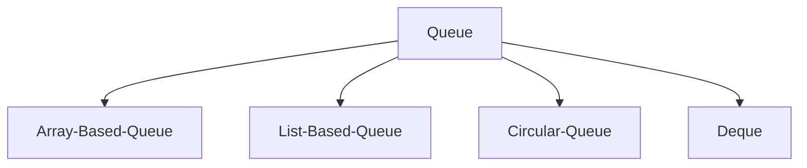

# 큐(Queue)


## 배열 기반 큐(Array Based Queue)
### Declaration
```c
#define QUEUE_SIZE 5

typedef struct {
    int data[QUEUE_SIZE];
    int size;
} Queue;
```
### Method
|NO|METHOD                                                              |DESCRIPTION
|-:|:-------------------------------------------------------------------|:--
| 1|void enqueue(Queue* queue, int data)                             	|큐에 데이터를 추가합니다.
| 2|int dequeue(Queue* queue)  											|큐에 먼저 추가한 데이터를 가져오고, 큐에서 해당 데이터를 제거합니다.
| 3|int peek(Queue* queue)   											|큐에 먼저 추가한 데이터를 가져옵니다.
| 4|bool is_empty(Queue* queue)                      					|큐가 비어있는지 여부를 반환합니다.
| 5|bool is_full(Queue* queue)                       					|큐가 가득 찼는지 여부를 반환합니다.
| 6|void clear(Queue* queue)            								|큐를 비웁니다.
| 7|void print(Queue* queue)                           					|큐의 데이터들을 출력합니다.
### Prototype
```c
/**
 *  @brief 큐에 데이터를 추가합니다.
 *  
 *  @param queue
 *  큐의 주소
 *  @param data
 *  큐에 추가할 데이터 값
 *  
 *  @return void
 *  
 *  @exception queue가 NULL인 경우
 *  "Error: Queue is NULL." 출력 후 함수 종료
 *  @exception queue가 가득 찬 경우
 *  "Error: Queue is full." 출력 후 함수 종료
 */
void enqueue(Queue* queue, int data);

/**
 *  @brief 큐에 먼저 추가한 데이터를 가져오고, 큐에서 해당 데이터를 제거합니다.
 *  
 *  @param queue
 *  큐의 주소
 *  
 *  @return int
 *  큐에 먼저 추가한 데이터
 *  
 *  @exception queue가 NULL인 경우
 *  "Error: Queue is NULL." 출력 후 -1 반환
 *  @exception queue가 비어있는 경우
 *  "Error: Queue is empty." 출력 후 -1 반환
 */
int dequeue(Queue* queue);

/**
 *  @brief 큐에 먼저 추가한 데이터를 가져옵니다.
 *  
 *  @param queue
 *  큐의 주소
 *  
 *  @return int
 *  큐에 먼저 추가한 데이터
 *  
 *  @exception queue가 NULL인 경우
 *  "Error: Queue is NULL." 출력 후 -1 반환
 *  @exception queue가 비어있는 경우
 *  "Error: Queue is empty." 출력 후 -1 반환
 */
int peek(Queue* queue);

/**
 *  @brief 큐가 비어있는지 여부를 반환합니다.
 *  
 *  @param queue
 *  큐의 주소
 *  
 *  @return bool
 *  큐가 비어있으면 true, 비어있지 않으면 false 반환
 *  
 *  @exception queue가 NULL인 경우
 *  "Error: Queue is NULL." 출력 후 false 반환
 */
bool is_empty(Queue* queue);

/**
 *  @brief 큐가 가득 찼는지 여부를 반환합니다.
 *  
 *  @param queue
 *  큐의 주소
 *  
 *  @return bool
 *  큐가 가득 찼으면 true, 가득 차지 않았으면 false 반환
 *  
 *  @exception queue가 NULL인 경우
 *  "Error: Queue is NULL." 출력 후 false 반환
 */
bool is_full(Queue* queue);

/**
 *  @brief 큐를 비웁니다.
 *  
 *  @param queue
 *  큐의 주소
 *  
 *  @return void
 *  
 *  @exception queue가 NULL인 경우
 *  "Error: Queue is NULL." 출력 후 함수 종료
 */
void clear(Queue* queue);

/**
 *  @brief 큐의 데이터들을 출력합니다.
 *  
 *  @param queue
 *  큐의 주소
 *  
 *  @return void
 *  
 *  @exception queue가 NULL인 경우
 *  "Error: Queue is NULL." 출력 후 함수 종료
 */
void print(Queue* queue);
```

## 리스트 기반 큐(List Based Queue)
### Declaration
```c
typedef struct SinglyLinkedNode {
    int data;
    struct SinglyLinkedNode* next;
} SinglyLinkedNode;

typedef struct {
    SinglyLinkedNode* front;
    SinglyLinkedNode* rear;
    int size;
} Queue;
```
### Method
|NO|METHOD                                                              |DESCRIPTION
|-:|:-------------------------------------------------------------------|:--
| 1|void enqueue(Queue* queue, int data)                             	|큐에 데이터를 추가합니다.
| 2|int dequeue(Queue* queue)  											|큐에 먼저 추가한 데이터를 가져오고, 큐에서 해당 데이터를 제거합니다.
| 3|int peek(Queue* queue)   											|큐에 먼저 추가한 데이터를 가져옵니다.
| 4|bool is_empty(Queue* queue)                      					|큐가 비어있는지 여부를 반환합니다.
| 5|void clear(Queue* queue)            								|큐를 비웁니다.
| 6|void print(Queue* queue)                           					|큐의 데이터들을 출력합니다.
### Prototype
```c
/**
 *  @brief 큐에 데이터를 추가합니다.
 *  
 *  @param queue
 *  큐의 주소
 *  @param data
 *  큐에 추가할 데이터 값
 *  
 *  @return void
 *  
 *  @exception queue가 NULL인 경우
 *  "Error: Queue is NULL." 출력 후 함수 종료
 *  @exception 새로운 노드 메모리 할당 실패 시
 *  "Error: Memory allocation is faild." 출력 후 함수 종료
 */
void enqueue(Queue* queue, int data);

/**
 *  @brief 큐에 먼저 추가한 데이터를 가져오고, 큐에서 해당 데이터를 제거합니다.
 *  
 *  @param queue
 *  큐의 주소
 *  
 *  @return int
 *  큐에 먼저 추가한 데이터
 *  
 *  @exception queue가 NULL인 경우
 *  "Error: Queue is NULL." 출력 후 -1 반환
 *  @exception queue가 비어있는 경우
 *  "Error: Queue is empty." 출력 후 -1 반환
 */
int dequeue(Queue* queue);

/**
 *  @brief 큐에 먼저 추가한 데이터를 가져옵니다.
 *  
 *  @param queue
 *  큐의 주소
 *  
 *  @return int
 *  큐에 먼저 추가한 데이터
 *  
 *  @exception queue가 NULL인 경우
 *  "Error: Queue is NULL." 출력 후 -1 반환
 *  @exception queue가 비어있는 경우
 *  "Error: Queue is empty." 출력 후 -1 반환
 */
int peek(Queue* queue);

/**
 *  @brief 큐가 비어있는지 여부를 반환합니다.
 *  
 *  @param queue
 *  큐의 주소
 *  
 *  @return bool
 *  큐가 비어있으면 true, 비어있지 않으면 false 반환
 *  
 *  @exception queue가 NULL인 경우
 *  "Error: Queue is NULL." 출력 후 false 반환
 */
bool is_empty(Queue* queue);

/**
 *  @brief 큐를 비웁니다.
 *  
 *  @param queue
 *  큐의 주소
 *  
 *  @return void
 *  
 *  @exception queue가 NULL인 경우
 *  "Error: Queue is NULL." 출력 후 함수 종료
 */
void clear(Queue* queue);

/**
 *  @brief 큐의 데이터들을 출력합니다.
 *  
 *  @param queue
 *  큐의 주소
 *  
 *  @return void
 *  
 *  @exception queue가 NULL인 경우
 *  "Error: Queue is NULL." 출력 후 함수 종료
 */
void print(Queue* queue);
```

## 순환 큐(Circular Queue)
### Declaration
```c
#define QUEUE_SIZE 5

typedef struct {
    int data[QUEUE_SIZE + 1];
    int front;
    int rear;
} Queue;
```
### Method
|NO|METHOD                                                              |DESCRIPTION
|-:|:-------------------------------------------------------------------|:--
| 1|void enqueue(Queue* queue, int data)                             	|큐에 데이터를 추가합니다.
| 2|int dequeue(Queue* queue)  											|큐에 먼저 추가한 데이터를 가져오고, 큐에서 해당 데이터를 제거합니다.
| 3|int peek(Queue* queue)   											|큐에 먼저 추가한 데이터를 가져옵니다.
| 4|bool is_empty(Queue* queue)                      					|큐가 비어있는지 여부를 반환합니다.
| 5|int size(Queue* queue)                      						|큐에 담긴 데이터의 개수를 반환합니다.
| 6|void clear(Queue* queue)            								|큐를 비웁니다.
| 7|void print(Queue* queue)                           					|큐의 데이터들을 출력합니다.
### Prototype
```c
/**
 *  @brief 큐에 데이터를 추가합니다.
 *  
 *  @param queue
 *  큐의 주소
 *  @param data
 *  큐에 추가할 데이터 값
 *  
 *  @return void
 *  
 *  @exception queue가 NULL인 경우
 *  "Error: Queue is NULL." 출력 후 함수 종료
 *  @exception queue가 가득 찬 경우
 *  "Error: Queue is full." 출력 후 함수 종료
 */
void enqueue(Queue* queue, int data);

/**
 *  @brief 큐에 먼저 추가한 데이터를 가져오고, 큐에서 해당 데이터를 제거합니다.
 *  
 *  @param queue
 *  큐의 주소
 *  
 *  @return int
 *  큐에 먼저 추가한 데이터
 *  
 *  @exception queue가 NULL인 경우
 *  "Error: Queue is NULL." 출력 후 -1 반환
 *  @exception queue가 비어있는 경우
 *  "Error: Queue is empty." 출력 후 -1 반환
 */
int dequeue(Queue* queue);

/**
 *  @brief 큐에 먼저 추가한 데이터를 가져옵니다.
 *  
 *  @param queue
 *  큐의 주소
 *  
 *  @return int
 *  큐에 먼저 추가한 데이터
 *  
 *  @exception queue가 NULL인 경우
 *  "Error: Queue is NULL." 출력 후 -1 반환
 *  @exception queue가 비어있는 경우
 *  "Error: Queue is empty." 출력 후 -1 반환
 */
int peek(Queue* queue);

/**
 *  @brief 큐가 비어있는지 여부를 반환합니다.
 *  
 *  @param queue
 *  큐의 주소
 *  
 *  @return bool
 *  큐가 비어있으면 true, 비어있지 않으면 false 반환
 *  
 *  @exception queue가 NULL인 경우
 *  "Error: Queue is NULL." 출력 후 false 반환
 */
bool is_empty(Queue* queue);

/**
 *  @brief 큐가 가득 찼는지 여부를 반환합니다.
 *  
 *  @param queue
 *  큐의 주소
 *  
 *  @return bool
 *  큐가 가득 찼으면 true, 가득 차지 않았으면 false 반환
 *  
 *  @exception queue가 NULL인 경우
 *  "Error: Queue is NULL." 출력 후 false 반환
 */
bool is_full(Queue* queue);

/**
 *  @brief 큐에 담긴 데이터의 개수를 반환합니다.
 *  
 *  @param queue
 *  큐의 주소
 *  
 *  @return int
 *  큐에 담긴 데이터의 개수
 *  
 *  @exception queue가 NULL인 경우
 *  "Error: Queue is NULL." 출력 후 -1 반환
 */
int size(Queue* queue);

/**
 *  @brief 큐를 비웁니다.
 *  
 *  @param queue
 *  큐의 주소
 *  
 *  @return void
 *  
 *  @exception queue가 NULL인 경우
 *  "Error: Queue is NULL." 출력 후 함수 종료
 */
void clear(Queue* queue);

/**
 *  @brief 큐의 데이터들을 출력합니다.
 *  
 *  @param queue
 *  큐의 주소
 *  
 *  @return void
 *  
 *  @exception queue가 NULL인 경우
 *  "Error: Queue is NULL." 출력 후 함수 종료
 */
void print(Queue* queue);
```

## 덱(Deque)
### Declaration
```c
typedef struct DoublyLinkedNode {
    int data;
    struct DoublyLinkedNode* prev;
    struct DoublyLinkedNode* next;
} DoublyLinkedNode;

typedef struct {
    DoublyLinkedNode* front;
    DoublyLinkedNode* rear;
    int size;
} Deque;
```
### Method
|NO|METHOD                                                              |DESCRIPTION
|-:|:-------------------------------------------------------------------|:--
| 1|DoublyLinkedNode* create_node(int data)                             |데이터를 가지고 있는 새로운 노드를 생성합니다.
| 2|void push_front(Deque* deque, int data)                             |덱의 맨 앞에 데이터를 추가합니다.
| 3|void push_rear(Deque* deque, int data)                              |덱의 맨 뒤에 데이터를 추가합니다.
| 4|int pop_front(Deque* deque)                                         |덱의 맨 앞 데이터를 가져오고, 덱에서 해당 데이터를 제거합니다.
| 5|int pop_rear(Deque* deque)                                          |덱의 맨 뒤 데이터를 가져오고, 덱에서 해당 데이터를 제거합니다.
| 6|int peek_front(Deque* deque)                                        |덱의 맨 앞 데이터를 가져옵니다.
| 7|int peek_rear(Deque* deque)                                         |덱의 맨 뒤 데이터를 가져옵니다.
| 8|bool is_empty(Deque* deque)                                         |덱이 비어있는지 여부를 반환합니다.
| 9|void clear(Deque* deque)                                            |덱을 비웁니다.
|10|void print(Deque* deque)                                            |덱의 데이터들을 출력합니다.
### Prototype
```c
/**
 *  @brief 데이터를 가지고 있는 새로운 노드를 생성합니다.
 *
 *  @param data
 *  생성할 노드의 데이터 값
 *
 *  @return DoublyLinkedNode*
 *  data 값을 가진 이중 연결 노드의 주소
 *
 *  @exception 메모리 할당 실패 시
 *  "Error: Memory allocation is faild." 출력 후 NULL 반환
 */
DoublyLinkedNode* create_node(int data);

/**
 *  @brief 덱의 맨 앞에 데이터를 추가합니다.
 *  
 *  @param deque
 *  덱의 주소
 *  @param data
 *  덱에 추가할 데이터 값
 *  
 *  @return void
 *  
 *  @exception deque가 NULL인 경우
 *  "Error: Deque is NULL." 출력 후 함수 종료
 *  @exception 새로운 노드 생성에 실패한 경우
 *  함수 종료
 */
void push_front(Deque* deque, int data);

/**
 *  @brief 덱의 맨 뒤에 데이터를 추가합니다.
 *  
 *  @param deque
 *  덱의 주소
 *  @param data
 *  덱에 추가할 데이터 값
 *  
 *  @return void
 *  
 *  @exception deque가 NULL인 경우
 *  "Error: Deque is NULL." 출력 후 함수 종료
 *  @exception 새로운 노드 생성에 실패한 경우
 *  함수 종료
 */
void push_rear(Deque* deque, int data);

/**
 *  @brief 덱의 맨 앞 데이터를 가져오고, 덱에서 해당 데이터를 제거합니다.
 *  
 *  @param deque
 *  덱의 주소
 *  
 *  @return int
 *  덱의 맨 앞 데이터
 *  
 *  @exception deque가 NULL인 경우
 *  "Error: Deque is NULL." 출력 후 -1 반환
 *  @exception deque이 비어있는 경우
 *  "Error: Deque is empty." 출력 후 -1 반환
 */
int pop_front(Deque* deque);

/**
 *  @brief 덱의 맨 뒤 데이터를 가져오고, 덱에서 해당 데이터를 제거합니다.
 *  
 *  @param deque
 *  덱의 주소
 *  
 *  @return int
 *  덱의 맨 뒤 데이터
 *  
 *  @exception deque가 NULL인 경우
 *  "Error: Deque is NULL." 출력 후 -1 반환
 *  @exception deque이 비어있는 경우
 *  "Error: Deque is empty." 출력 후 -1 반환
 */
int pop_rear(Deque* deque);

/**
 *  @brief 덱의 맨 앞 데이터를 가져옵니다.
 *  
 *  @param deque
 *  덱의 주소
 *  
 *  @return int
 *  덱의 맨 앞 데이터
 *  
 *  @exception deque가 NULL인 경우
 *  "Error: Deque is NULL." 출력 후 -1 반환
 *  @exception deque이 비어있는 경우
 *  "Error: Deque is empty." 출력 후 -1 반환
 */
int peek_front(Deque* deque);

/**
 *  @brief 덱의 맨 뒤 데이터를 가져옵니다.
 *  
 *  @param deque
 *  덱의 주소
 *  
 *  @return int
 *  덱의 맨 뒤 데이터
 *  
 *  @exception deque가 NULL인 경우
 *  "Error: Deque is NULL." 출력 후 -1 반환
 *  @exception deque이 비어있는 경우
 *  "Error: Deque is empty." 출력 후 -1 반환
 */
int peek_rear(Deque* deque);

/**
 *  @brief 덱이 비어있는지 여부를 반환합니다.
 *  
 *  @param deque
 *  덱의 주소
 *  
 *  @return bool
 *  덱이 비어있으면 true, 비어있지 않으면 false 반환
 *  
 *  @exception deque가 NULL인 경우
 *  "Error: Deque is NULL." 출력 후 false 반환
 */
bool is_empty(Deque* deque);

/**
 *  @brief 덱을 비웁니다.
 *  
 *  @param deque
 *  덱의 주소
 *  
 *  @return void
 *  
 *  @exception deque가 NULL인 경우
 *  "Error: Deque is NULL." 출력 후 함수 종료
 */
void clear(Deque* deque);

/**
 *  @brief 덱의 데이터들을 출력합니다.
 *  
 *  @param deque
 *  덱의 주소
 *  
 *  @return void
 *  
 *  @exception deque가 NULL인 경우
 *  "Error: Deque is NULL." 출력 후 함수 종료
 */
void print(Deque* deque);
```
