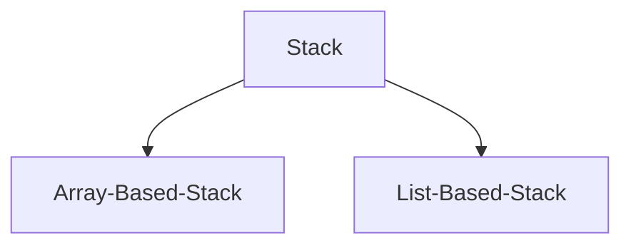

# 스택(Stack)

## 배열 기반 스택(Array Based Stack)
### Declaration
```c
#define STACK_SIZE 5

typedef struct {
    int data[STACK_SIZE];
    int size;
} Stack;
```
### Method
|NO|METHOD                                                              |DESCRIPTION
|-:|:-------------------------------------------------------------------|:--
| 1|void push(Stack* stack, int data)                             		|스택에 데이터를 추가합니다.
| 2|int pop(Stack* stack)   											|스택에 마지막으로 추가한 데이터를 가져오고, 스택에서 해당 데이터를 제거합니다.
| 3|int peek(Stack* stack)   											|스택에 마지막으로 추가한 데이터를 가져옵니다.
| 4|bool is_empty(Stack* stack)                      					|스택이 비어있는지 여부를 반환합니다.
| 5|bool is_full(Stack* stack)                       					|스택이 가득 찼는지 여부를 반환합니다.
| 6|void clear(Stack* stack)            								|스택을 비웁니다.
| 7|void print(Stack* stack)                           					|스택의 데이터들을 출력합니다.

### Prototype
```c
/**
 *  @brief 스택에 데이터를 추가합니다.
 *  
 *  @param stack
 *  스택의 주소
 *  @param data
 *  스택에 추가할 데이터 값
 *  
 *  @return void
 *  
 *  @exception stack이 NULL인 경우
 *  "Error: Stack is NULL." 출력 후 함수 종료
 *  @exception stack이 가득 찬 경우
 *  "Error: Stack is full." 출력 후 함수 종료
 */
void push(Stack* stack, int data);

/**
 *  @brief 스택에 마지막으로 추가한 데이터를 가져오고, 스택에서 해당 데이터를 제거합니다.
 *  
 *  @param stack
 *  스택의 주소
 *  
 *  @return int
 *  스택에 마지막으로 추가한 데이터
 *  
 *  @exception stack이 NULL인 경우
 *  "Error: Stack is NULL." 출력 후 -1 반환
 *  @exception stack이 비어있는 경우
 *  "Error: Stack is empty." 출력 후 -1 반환
 */
int pop(Stack* stack);

/**
 *  @brief 스택에 마지막으로 추가한 데이터를 가져옵니다.
 *  
 *  @param stack
 *  스택의 주소
 *  
 *  @return int
 *  스택에 마지막으로 추가한 데이터
 *  
 *  @exception stack이 NULL인 경우
 *  "Error: Stack is NULL." 출력 후 -1 반환
 *  @exception stack이 비어있는 경우
 *  "Error: Stack is empty." 출력 후 -1 반환
 */
int peek(Stack* stack);

/**
 *  @brief 스택이 비어있는지 여부를 반환합니다.
 *  
 *  @param stack
 *  스택의 주소
 *  
 *  @return bool
 *  스택이 비어있으면 true, 비어있지 않으면 false 반환
 *  
 *  @exception stack이 NULL인 경우
 *  "Error: Stack is NULL." 출력 후 false 반환
 */
bool is_empty(Stack* stack);

/**
 *  @brief 스택이 가득 찼는지 여부를 반환합니다.
 *  
 *  @param stack
 *  스택의 주소
 *  
 *  @return bool
 *  스택이 가득 찼으면 true, 가득 차지 않았으면 false 반환
 *  
 *  @exception stack이 NULL인 경우
 *  "Error: Stack is NULL." 출력 후 false 반환
 */
bool is_full(Stack* stack);

/**
 *  @brief 스택을 비웁니다.
 *  
 *  @param stack
 *  스택의 주소
 *  
 *  @return void
 *  
 *  @exception stack이 NULL인 경우
 *  "Error: Stack is NULL." 출력 후 함수 종료
 */
void clear(Stack* stack);

/**
 *  @brief 스택의 데이터들을 출력합니다.
 *  
 *  @param stack
 *  스택의 주소
 *  
 *  @return void
 *  
 *  @exception stack이 NULL인 경우
 *  "Error: Stack is NULL." 출력 후 함수 종료
 */
void print(Stack* stack);
```

## 리스트 기반 스택(List Based Stack)
### Declaration
```c
typedef struct SinglyLinkedNode {
    int data;
    struct SinglyLinkedNode* next;
} SinglyLinkedNode;

typedef struct {
    SinglyLinkedNode* top;
    int size;
} Stack;
```
### Method
|NO|METHOD                                                              |DESCRIPTION
|-:|:-------------------------------------------------------------------|:--
| 1|void push(Stack* stack, int data)                             		|스택에 데이터를 추가합니다.
| 2|int pop(Stack* stack)   											|스택에 마지막으로 추가한 데이터를 가져오고, 스택에서 해당 데이터를 제거합니다.
| 3|int peek(Stack* stack)   											|스택에 마지막으로 추가한 데이터를 가져옵니다.
| 4|bool is_empty(Stack* stack)                      					|스택이 비어있는지 여부를 반환합니다.
| 5|void clear(Stack* stack)            								|스택을 비웁니다.
| 6|void print(Stack* stack)                           					|스택의 데이터들을 출력합니다.

### Prototype
```c
/**
 *  @brief 스택에 데이터를 추가합니다.
 *  
 *  @param stack
 *  스택의 주소
 *  @param data
 *  스택에 추가할 데이터 값
 *  
 *  @return void
 *  
 *  @exception stack이 NULL인 경우
 *  "Error: Stack is NULL." 출력 후 함수 종료
 *  @exception 새로운 노드 메모리 할당 실패 시
 *  "Error: Memory allocation is faild." 출력 후 함수 종료
 */
void push(Stack* stack, int data);

/**
 *  @brief 스택에 마지막으로 추가한 데이터를 가져오고, 스택에서 해당 데이터를 제거합니다.
 *  
 *  @param stack
 *  스택의 주소
 *  
 *  @return int
 *  스택에 마지막으로 추가한 데이터
 *  
 *  @exception stack이 NULL인 경우
 *  "Error: Stack is NULL." 출력 후 -1 반환
 *  @exception stack이 비어있는 경우
 *  "Error: Stack is empty." 출력 후 -1 반환
 */
int pop(Stack* stack);

/**
 *  @brief 스택에 마지막으로 추가한 데이터를 가져옵니다.
 *  
 *  @param stack
 *  스택의 주소
 *  
 *  @return int
 *  스택에 마지막으로 추가한 데이터
 *  
 *  @exception stack이 NULL인 경우
 *  "Error: Stack is NULL." 출력 후 -1 반환
 *  @exception stack이 비어있는 경우
 *  "Error: Stack is empty." 출력 후 -1 반환
 */
int peek(Stack* stack);

/**
 *  @brief 스택이 비어있는지 여부를 반환합니다.
 *  
 *  @param stack
 *  스택의 주소
 *  
 *  @return bool
 *  스택이 비어있으면 true, 비어있지 않으면 false 반환
 *  
 *  @exception stack이 NULL인 경우
 *  "Error: Stack is NULL." 출력 후 false 반환
 */
bool is_empty(Stack* stack);

/**
 *  @brief 스택을 비웁니다.
 *  
 *  @param stack
 *  스택의 주소
 *  
 *  @return void
 *  
 *  @exception stack이 NULL인 경우
 *  "Error: Stack is NULL." 출력 후 함수 종료
 */
void clear(Stack* stack);

/**
 *  @brief 스택의 데이터들을 출력합니다.
 *  
 *  @param stack
 *  스택의 주소
 *  
 *  @return void
 *  
 *  @exception stack이 NULL인 경우
 *  "Error: Stack is NULL." 출력 후 함수 종료
 */
void print(Stack* stack);
```
